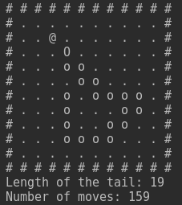
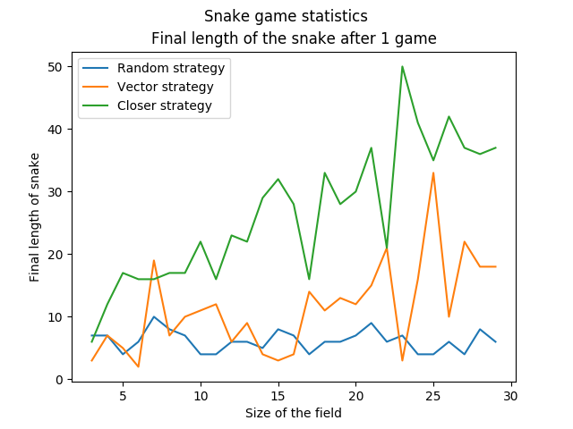
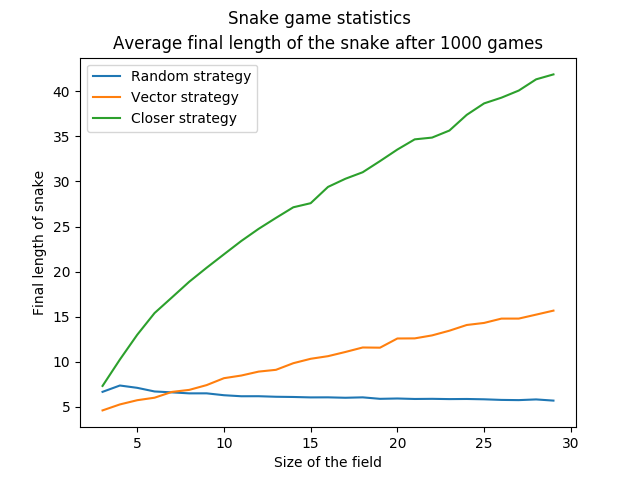
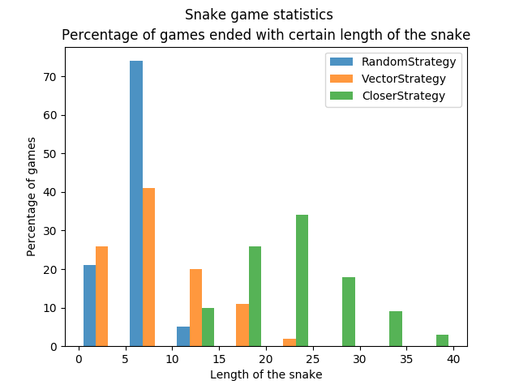

# Snake game
Implementation of a Snake game with basic AI strategies.

Rules: The main goal is to collect as much food as possible with snake. You can move in 4 directions and when you eat food, your snake grows. If you move into your tail or a wall, the game is over.

The program simulates games with three different strategies. It shows one game in the console and then collects statistics from hundred games into graphs.

## Implementation
The program is implemented using OOP. The main classes are: Game, Snake, Food and classes for the three strategies. Snake and Food are used just to represent the objects and for basic manipulation with them. The main logic is in the Game class. It stores all the needed objects, utility methods and methods for the game cycle. If set, it also prints the information about the current game (e.g. the field). Strategies comunicate with the Game just through a method think(), which returns the next desired direction of the snake.

## Strategies
There are three strategies: random, vector and closer. Random just moves to a random free field. Vector strategy goes straight ahead until it reaches the same x coordinate as the food and then the same with the y coordinate, but it does not care whether the field is free or not. The closer strategy finds the closest field to food from all free neighbour fields and goes there.

## Statistics
There are two main factors which change among the strategies: the length of the snake at the end and the number of moves at the end. I examined only the length, because it is more interesting. The first graph shows final length of the snake after one game. Games where played on increasing field from 3x3 up to 29x29 field. You can see that vector and closer are randomly oscilating, so there goes second graph showing the same idea, but played on 1 000 games on each field. The third picture is a histogram showing percentage of games ended with certain length of the snake.

